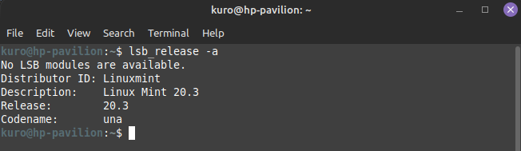
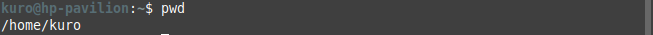
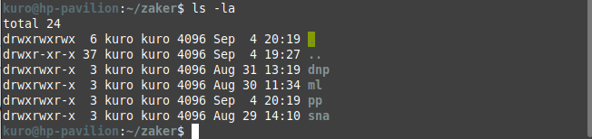
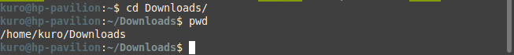
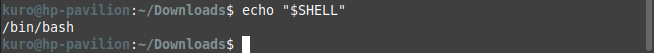
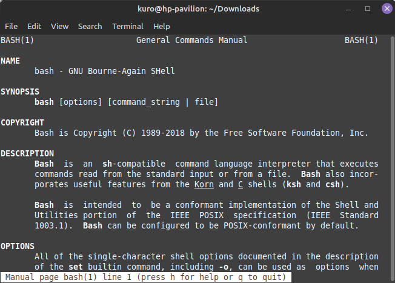

## System and Network Administration - Lab 1 - Introduction to Linux
    Jaffar Totanji - j.totanji@innopolis.university

### Exercise 1 - Finding your way around Linux:

### Questions to answer:
1. My personal machine's hostname is `hp-pavilion`. I checked it using the command `hostname`. Alternately, most shells display it by default as a prefix to any command in the form of `user@machine_hostname:`.

2. My Linux distro is Linux Mint v20.3. I checked it using `lsb_release -a`.

3. The root directory is `/`.

4. `Bash` is a superset of `sh` with a more elegant syntax and more functionality. It is safe to use a Bash shebang line in almost all cases. For a long time `/bin/sh` used to point to `/bin/bash`, however, that changed recently such as on modern Debian and Ubuntu systems, which symlink `sh` to `dash` by default.

5. - `-i` The shell is interactive.
   - `-v` Print shell input lines as they are read.
   - `-x` Print commands and their arguments as they are executed.

6. - `Garuda Linux` Supports games out of the box.
   - `Arch Linux` Torture.
   - `Pop!_OS` Simple.
   - `Manjaro Linux` A user-friendly arch-based distro.
   - `Kubuntu` Lightweight.

7. `POSIX` is a family of standards, specified by the `IEEE`, to clarify and make uniform the application programming interfaces (and ancillary issues, such as commandline shell utilities) provided by Unix-y operating systems.

8. When you write your programs to rely on `POSIX` standards, you can be pretty sure to be able to port them easily among a large family of Unix derivatives (including Linux, but not limited to it!); if and when you use some Linux API that's not standardized as part of Posix, you will have a harder time if and when you want to port that program or library to other Unix-y systems (e.g., MacOSX) in the future.

9. `Slackware` is very minimalistic with pretty much everything, most notably its package manager, especially compared to debian. It doesn't have many packages available by default, and it doesn't do dependency resolution.

10. the `uname` command prints system information. With the `-a` flag it prints the following information in order: 
    - kernel name
    - network node hostname
    - kernel release
    - kernel version
    - machine hardware name
    - processor type
    - hardware platform
    - operating system

## End of Exercises

### Sources: 
[Stackoverflow thread about POSIX](https://stackoverflow.com/questions/1780599/what-is-the-meaning-of-posix)

[Stackoverflow thread about sh and bash](https://stackoverflow.com/questions/5725296/difference-between-sh-and-bash)

[Reddit thread about the differences between Slackware and Debian](https://www.reddit.com/r/linux/comments/113h9l/debian_vs_slackware_which_operating_system_is/)

[Google](https://www.google.com/)
