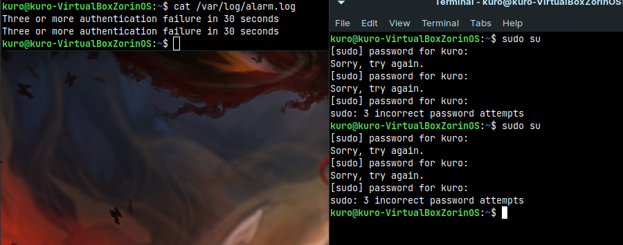
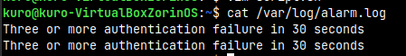

## System and Network Administration - Lab 10 - Logging and auditing
    Jaffar Totanji - j.totanji@innopolis.university

### Questions to answer:
1. I would give `Wazuh` (https://wazuh.com/) a shot. Open-source, great product. I also know some great engineers who work there :).

2. To do that, we first create a new configuration file `/etc/rsyslog.d/auth-errors.conf`, and populate it with a rule to save all `authentication` and `security` messages with the priority `alert` or higher to `/var/log/auth-errors`:

    
    

    We then restart rsyslog using `systemctl restart rsyslog` for the new changes to take effect. To test our new additions, we can log a message of priority `auth.alert` using `logger`:

    

    We can now see our new log entry using `journalctl`:

    

    and `rsyslog`:

    

3. Let's first install Apache web server:

        sudo apt update
        sudo apt install apache2
    
    We can then access `localhost` to verify that it's running:

    

    Apache comes with its own `logrotate` configuration in `/etc/logrotate.d/apache2`, we can edit that to meet our needs. This is what it looks like after removing the default `daily` rotation, it performs various operations including `compression` and `restarting the server`. I have also adjusted it to hold half a week's worth of logs:

    

    We can now create a `crontab` to rotate the table every 6 hours:

    

    Let's access the server a couple of times to populate our `access.log`:

    

    We can force the rotation to observe the results instead of waiting 6 hours:

    

    Let's take a look at `access.log`:

    

    We can tell it has been rotated. And `error.log` can show us that the server has been restarted:

    

    We can also see all the old log files:

    

4. We can create a simple script that continuously checks logs being added to `/var/log/auth.log` and tries to match `3 incorrect password attempts` which is issued by the system upon failing to authenticate a user 3 times within 30 seconds. Upon matching the given text, the script will append the text `Three or more authentication failure in 30 seconds` to `/var/log/alarm.log`:

    

    And the script in action:

    
    

5. We first add the following line to our `bashrc` file, found in `~/.bashrc`:

        export PROMPT_COMMAND='RETRN_VAL=$?;logger -p local6.debug "$(whoami) [$$]: $(history 1 | sed "s/^[ ]*[0-9]\+[ ]*//" ) [$RETRN_VAL]"'

    Then, we log everything from  `local6.*` to `/var/log/commands.log` by editing `/etc/rsyslog.d/bash.conf` and adding:

        local6.*    /var/log/commands.log

    We then edit `/etc/logrotate.d/rsyslog` to rotate the logs by adding the following line:

        /var/log/commands.log
    
    We restart `rsyslog`:

        sudo service rsyslog restart 

    And then log out and back into the system in order for our changes to take effect:

    

    

    We can switch to another user and try a different command:

    

    

    Here's what the log file looks like:

    

    The idea behind this is that `bash` provides an environment variable called `PROMPT_COMMAND`. The contents of this variable are executed as a regular `bash` command just before `bash` displays a prompt.

    We can then use `logger` to log whatever info we want to see. In this case, we save the return code to a variable `RETRN_VAL=$?`,`whoami` for the current user name, the PID of the current shell, and `history` to grab the last executed command, in conjunction with `sed` which is used to remove the command index number and the whitespaces outputted by the history command, and finally the return code at the end in square brackets.

## End of Exercises

## Resources:
- https://askubuntu.com/questions/93566/how-to-log-all-bash-commands-by-all-users-on-a-server/93570#93570

- http://blog.kxr.me/2012/01/logging-shell-commands-in-linux.html
