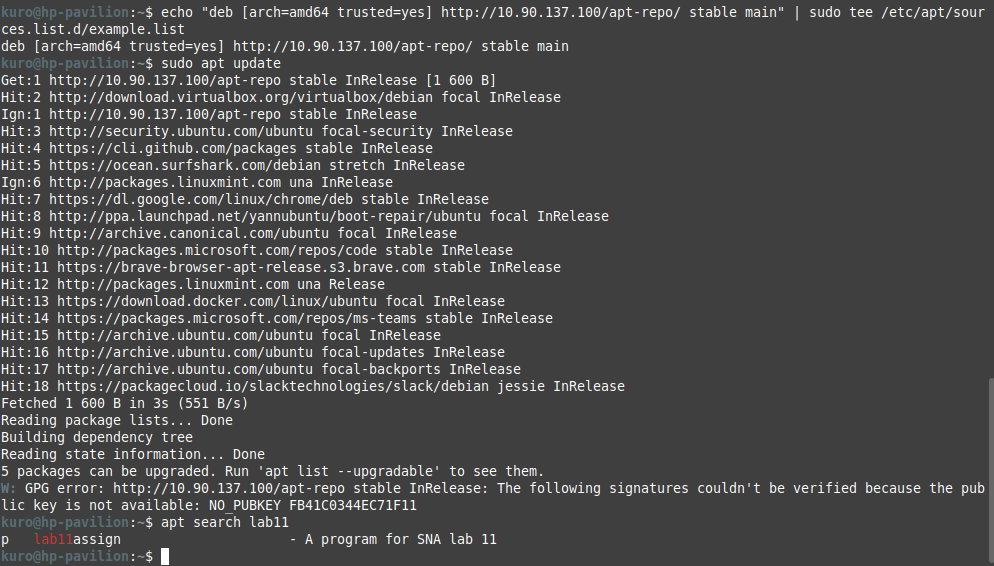
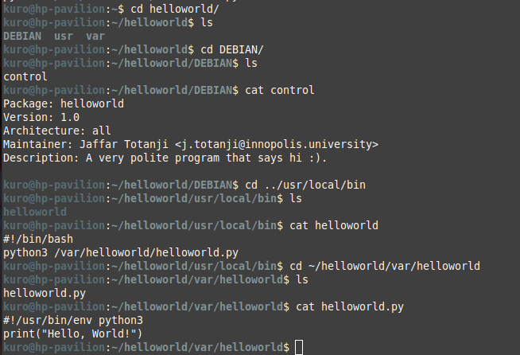
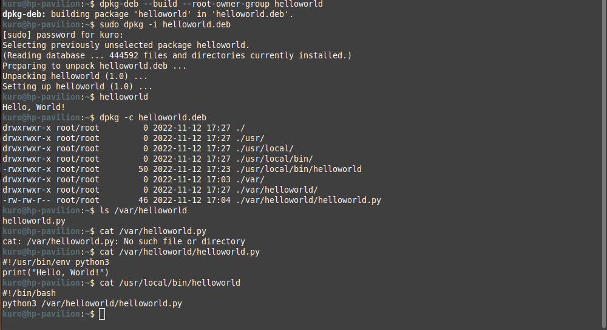

## System and Network Administration - Lab 11 - System time and Package managers
    Jaffar Totanji - j.totanji@innopolis.university

### Questions to answer:
1. An alternative to synchronizing with NTP servers on the internet would be to synchronize with GPS satellites, NTP will then only be used as a protocol that allows the system time to synchronise with a networked source. In this case the source will be the GPS module. To do so, we will need a GPS module, after acquiring that and connecting it to the system, our process will have the following flow:

    - We will start our GPS module using `gpsd`.
    - We can then check if our device is receiving signals from GPS satellites using `cgps`.
    - After making sure that our device is properly receiving signals, it is  possible to proceed with NTP by first permitting it through our firewall, and then editing the config.
    - Finally, we start and enable NTP, and we now have time synchronization using the GPS module.

    For the specific details of this operation, I found an article that explains everything pretty well: https://connecttech.com/resource-center/kdb349-gps-time-synchronization-linux/

2. A possible explanation to this situation would be that each of our servers connects by itself to external NTP servers to time sync. This can lead to the inconsistencies described here because every connection will have to go through several routers, each one with unpredictable latencies depending on traffic. The best approach would be to create a local NTP server, syncing time with an external NTP Server Pool, and using this local NTP server as "master clock" to our local servers. This solution would also scale pretty well in case new servers are added to the cluster.

3.  Debian, which is the parent linux distribution of many popular distros such as Ubuntu and Linux Mint, uses a set of tools called Advanced Packaging Tool (APT) to manage its packaging system (not the same as the `apt` command).

    There are various tools that interact with APT and allow the user to install, remove and manage packages in Debian based Linux distros. `apt-get` is one such command line tool which is widely popular along with others. There are several other similar commands such as `apt-cache`. This is where the original problem arises, these commands are way too low-level and they have so many functionalities that are perhaps never used by an average Linux user. While the most commonly used package management commands are scattered across `apt-get` and `apt-cache`.

    The `apt` commands have been introduced to solve this problem, offering some of the most widely used features from `apt-get` and `apt-cache` and dropping rarely used features.

    With `apt`, we get all the necessary tools in one place, as it was meant to provide a more efficient and human-friendly manner. It also enables a few options by defautl that help end users, and provides some pretty-printing functionalities such as progress bars.

4. `apt upgrade` is the command used to download and apply any available updates to our packages in a safe manner by NOT removing packages that are previously installed in a given Linux system, while `apt full-upgrade` command is used to do the same thing except if needed previously installed packages are removed to make the upgrade happen, which might leave behind some broken packages/dependencies. In a Sys Admin scenario, one could easily imagine how devastating it would be to break packages or depndency trees on a system which is being used by a large number of entities.

5. We can add the repository to our package index and mark it as `trusted` to force the update/installation of an unsigned repo with the following:

        echo "deb [arch=amd64 trusted=yes] http://10.90.137.100/apt-repo/ stable main" | sudo tee /etc/apt/sources.list.d/example.list
    
    We can now run:

        sudo apt update
    
    and then search for `lab11` in our list of available packages and we will find the desired package.

    

6. First things first, we create a directory with the desired name of our package. Let's say it's `helloworld`.

    Next, we create the internal structure of the package, in this case, our package is required to create a directory `/var/helloworld/` in the target system, so we create that directory inside the directory of our package `helloworld` as such `/helloworld/var/helloworld/`. 
    
    Another requirement is to have a python script `helloworld.py` within that directory, we simply create the script with a shebang wherever we want it to be located in our target system. In this case it will be `/helloworld/var/helloworld/helloworld.py`.
    
    Lastly, our package is required to include a command `helloworld` which will run `helloworld.py`, so we create a directory `/helloworld/usr/local/bin/`. Within that directory we create a bash script with the desired name of our command `helloworld` which simply runs our python script using:

        python3 /var/helloworld/helloworld.py

    We then add a shebang to the script and give it execute permissions and it's good to go.

    All that's left to create the `DEBIAN` directory with the `control` file containing information about our package and then to create the .deb file and install it.

    Below are screenshots of everything in action:

    The contents of the package:

    

    Installing and using the package:

    

## End of exercises

### Resources:
- https://itsfoss.com/apt-vs-apt-get-difference/#:~:text=In%20the%20end%2C%20to%20summarize,start%20using%20apt%20more%20often

- https://askubuntu.com/questions/445384/what-is-the-difference-between-apt-and-apt-get

- https://embeddedinventor.com/apt-upgrade-vs-full-upgrade-differences-explained-for-beginners/

- https://www.internalpointers.com/post/build-binary-deb-package-practical-guide