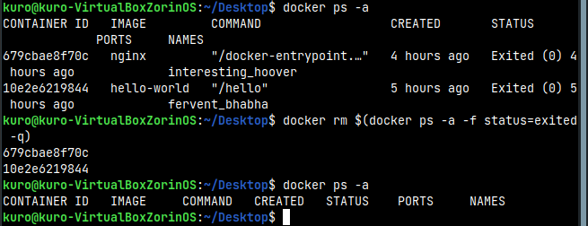
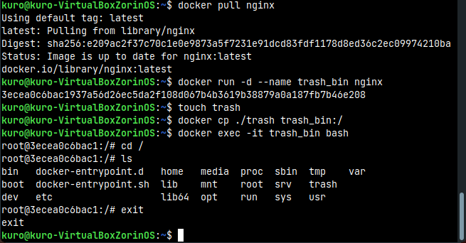
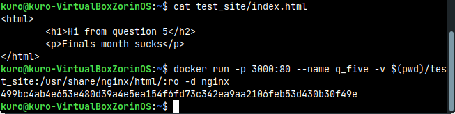
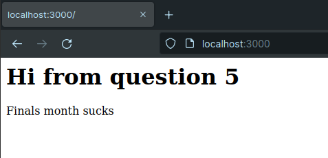
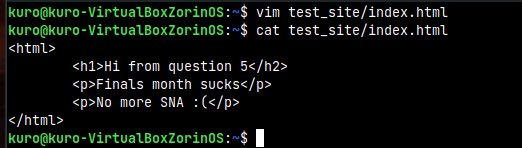
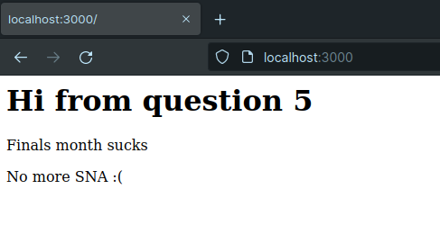
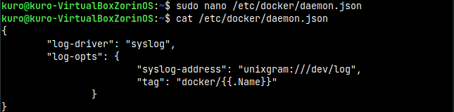
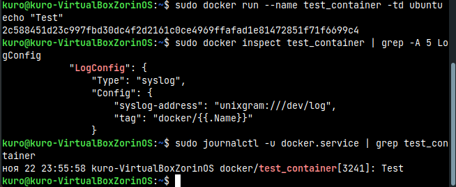

## System and Network Administration - Lab 12 - Docker
    Jaffar Totanji - j.totanji@innopolis.university

### Questions to answer:
1. 
    **Comparison**:

    - `CMD`: The `CMD` instruction allows us to set a default command, which will be executed only when we run a container without specifying a command. If a Docker container runs with a command, the default command will be ignored, and in case the Dockerfile has more than one `CMD` instruction, all but last `CMD` instructions are ignored.

    - `ENTRYPOINT`: The `ENTRYPOINT` instruction allows us to configure a container that will run as an executable. It looks similar to `CMD`, because it also allows us to specify a command with parameters. The difference is that the `ENTRYPOINT` command and parameters are not ignored when Docker container runs with command line parameters.

    **Use cases**:

    - `ENTRYPOINT` is preferred to `CMD` when building an executable Docker image where we need a command to always to be executed. 
    
    - `CMD` is used if we need to provide extra default arguments that could be overwritten from command line when the docker container runs. Hence, `CMD` is useful when we need to provide a default command and/or arguments that can be overwritten from command line when the docker container runs.    

2. 
    - The first and possibly the most important precaution anyone could take when dealiing with docker resources is to `run containers as a non-root user`. By default, Docker gives root permission to the processes within containers, which means they have full administrative access to the container and host environments. Just as we wouldn't run our processes as root on a standard Linux server, we wouldn’t run them as root in our containers.

    - A good precaution an organization could take is to `use their own private registry`. A private registry is a fully independent catalog of container images set up by the organization that uses it. They can host it on their own on-premises infrastructure or on a third-party registry service such as Amazon ECR , Azure Container Registry, etc. Private registries give an organization complete control over how they manage their images and generally offer more advanced features, which can help keep their inventory secure.

    - Third, `keep our images lean and clean`. The larger the image, the larger the attack surface of our Docker containers. In the case of a fully fledged VM, we have no choice but to use an entire operating system. But with Docker workloads, our containers only have to provide the resources our application needs. We should stick to that principle and try to minimize the size of a Docker image.

    - It is always good practice to `keep the host machine and docker up to date` It is essential to patch both Docker Engine and the underlying host operating system running Docker, to prevent a range of known vulnerabilities, many of which can result in container espaces. Since the kernel is shared by the container and the host, kernel exploits when an attacker manages to run on a container can directly affect the host. For example, a successful kernel exploit can enable attackers to break out of a non-privileged container and gain root access to the host machine.

    - One should never `expose the docker daemon socket`. The Docker daemon socket is a Unix network socket that facilitates communication with the Docker API. By default, this socket is owned by the root user. If anyone else obtains access to the socket, they will have permissions equivalent to root access to the host. Take note that it is possible to bind the daemon socket to a network interface, making the Docker container available remotely. This option should be enabled with care, especially in production containers.

    - Finally, one should always `limit container resources`. When a container is compromised, attackers may try to make use of the underlying host resources to perform malicious activity. Set Docker memory and CPU usage limits to minimize the impact of breaches for resource-intensive containers. In Docker, the default setting is to allow the container to access all RAM and CPU resources on the host. It is important to set resource quotas, to limit the resources your container can use—for security reasons, and to ensure each container has the appropriate resources and does not disrupt other services running on the host.

3. We can use the following command to list the exited containers:

        docker ps -a -f status=exited

    and then pass that to `docker rm` to have them removed:

        docker rm $(docker ps -a -f status=exited -q)
    
    Here's the command in action:

    

4. This can be done using `docker cp` as such:

    

5. We can do this using `volumes` to link a directory from our host machine to another in the container and reflect the changes we make to that directory on our host machine to output of the container:

    

    We can see the following ouput if we visit `localhost:3000`:

    

    We can then change `index.html` from our host machine and reload the site to see the changes:

    

    

6. We simply change the logging configuration for all new docker containers so that all new logs are forwarded to the centralized log of the host system. We can then easily find error messages using `journalctl`. Here's an example:

    

    

## End of exercises

### Resources:
- https://codewithyury.com/docker-run-vs-cmd-vs-entrypoint/
- https://jfrog.com/knowledge-base/3-essential-steps-to-securing-your-docker-container-deployments/
- https://blog.aquasec.com/docker-security-best-practices
- https://www.commandprompt.com/blog/docker-logging-with-rsyslog/