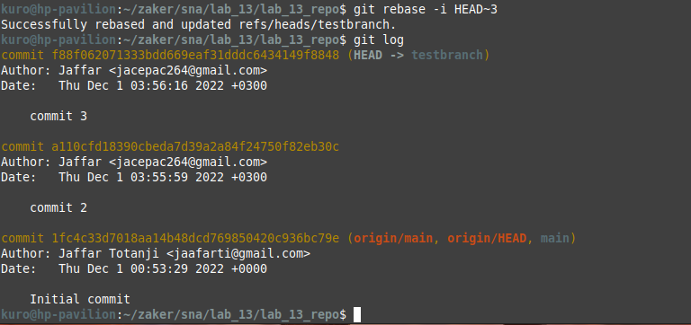

## System and Network Administration - Lab 13 - Git and GitLab CI/CD
    Jaffar Totanji - j.totanji@innopolis.university

### Questions to answer:
1. We first need to generate an SSH key using `ssh-keygen`
    

    Then we can simply add the key to Gitlab under `Profile -> Preferences -> SSH Keys`:

    

2. Squashing commits is the act of rewriting your commit history such that changes from one commit are added to its parent commit. This helps to maintain a clean and lean commit history before sharing one's work with team members or other people.

3. - **Rebase**: When merging a branch onto another branch, we're essentially telling Git to make it look as though we checked out to the other branch cleanly, then did all our owrk starting from there. That results in a clean, conceptually simple package of changes that can then be reviewed by someone. We can repeat this process again when there are new changes on the other branch, and we will always end up with a clean set of changes on the tip of the branch.

    - **Merge**: When merging a branch into another, we tie the two branch histories together. If we do this again later with more changes, we begin to create a somewhat "dirty" trail of histories which contains some of our own changes, and then some of the changes made on the other, original branch and so on.

4. 
    
    
    
    
    
    
    

5. No solution.

### End of exercises

