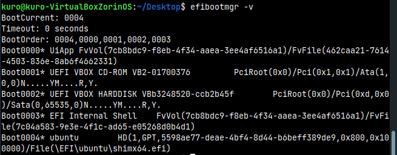
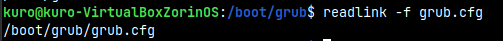

## System and Network Administration - Lab 2 - OS main components
    Jaffar Totanji - j.totanji@innopolis.university

### Exercise 1 - GPT partition:

### Questions to answer:
1. The `fdisk` utility is used to view, create, and manipulate partition tables. It understands GPT, MBR, Sun, SGI and BSD partition tables.

2. I can use the `fdisk -lu` command to view all the bootable devices on my machine. The bootable partition is the one with the type EFI System, in this case it is `/dev/sda1`.

3. Logical Block Addressing (LBA) is a common scheme used for specifying the location of blocks of data stored on computer storage devices.

4. The flags have the following functionalities:
    - `count`: Specifies the number of input blocks we want to dump.
    - `bs`: Specifies the amount of bytes we want to read/write at a time.
    - `skip=N`: Skips `N` input blocks at the start of input.

    We used `bs=512 count=1 skip=0` for the MBR dump because MBR starts at LBA 0 of the GPT layout. The flags mean that we don't want to read `512` bytes at a time (Size of LBA), and only dump one LBA, and skip nothing in the beginning.

    We used `bs=512 count=1 skip=1` for the GPT dump because we wanted to skip the first LBA as it contains the MBR info we previoiusly looked it and we want to view the GPT header info located right after.
5. GPT formatted disks tend to include a “protective MBR.” This protective MBR ensures the old tools won’t mistake the GPT drive for an unpartitioned drive and overwrite its GPT data with a new MBR because this type of MBR says that the GPT drive has a single partition that extends across the entire drive. This way, the GPT formatted drive is protected from being overwritten.

6. A logical partition is a volume that is created inside an extended partition on a basic MBR-based disk. Logical partitions are similar to primary partitions. However, while only four primary partitions can exist on a single disk, the number of logical partitions that can exist on a disk is unlimited. This was used to bypass the hard limit of 4 partitions that could be created on a legacy MBR-based disk. 

### Exercise 2 - UEFI Booting:

### Questions to answer:
1. It is related to the way Secure Boot works which is by using a set of keys embedded in the computer's firmware. These keys (or more precisely, their private counterparts) are used to sign boot loaders, drivers, option ROMs, and other software that the firmware runs. Most commodity PCs sold today include keys that Microsoft controls. Thus, to be able to install/run any Linux distribution, you must disable Secure Boot, find a Linux boot loader that's signed with Microsoft's keys, or replace your computer's standard keys with ones that you control. Using a pre-signed boot loader, such as the popular Shim program, is one of the more popular ways to do that, because using a pre-signed boot loader with the default key set means that your computer will accept as valid Microsoft's boot loaders and any others that Microsoft decides to sign.

2. The `GRUB` configuration file (`grub.cfg`) is located in `/boot/grub`.

3. According to the boot order, the third boot device on my virtual machine is the virtual CD-ROM. The info can be checked using `efibootmgr -v`.

### Exercise 3 - Filesystem:

### Questions to answer:
1. A lot.

2. The file system of my EFI partition is of the type `VFAT`, an extension of the `FAT` file system.

3. Mounted at my `/` directory is `/dev/sda2` which belongs to my virtual box harddisk.

4. Can be checked using `blkid | grep UUID=`, the `grep` command filters out results containing `UUID=`.

5. Some of the methods are:
    - Using `blkid`
    - Using `lsblk -f`
    - Using `ls -l /dev/disk/by-uuid`

6. `/dev/zero` is a special file in Unix-like operating systems that provides as many null characters as are read from it. One of the typical uses is to provide a character stream for initializing data storage.

## End of Exercises
