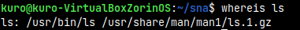

## System and Network Administration - Lab 3 - Command line and file manipulation
    Jaffar Totanji - j.totanji@innopolis.university

### Exercises:

### Questions to answer:
1. The Pipe or `|` in linux is used to send the output of one command to another for further processing. In this command `cat /etc/apt/sources.list | less` specifically, the pipe passes the output of `cat /etc/apt/sources.list` to `less` which then displays the output one page at a time, and is usually used to view large files.

2. `man` is divided into 8 different sections. There are certain terms that have different pages in different sections (e.g. printf as a command appears in section 1, as a `stdlib` function appears in section 3). Section 5 of `man` contains information about `File formats and conventions e.g. /etc/passwd.`. To tell `man` explicitly to open a specific section for our search, we can simply use:

        $ man [SECTION-NUM] [COMMAND NAME]

    and for section 5 we can use:

        $ man 5 [COMMAND NAME]
    
    for example: 

    
    

3. `ls` command on my virtual machine is located at `/usr/bin/ls`. We can find that using:

        whereis ls

     which shows the location of the command followed by its `man` page path.

4. Some of the ways to rename the file are:

        mv test_file.tot test_file.txt

    

        rename -v 's/.tot/.txt/' *.tot

    

5. First, I saved the given text to a file for readability of the required command, for that I used:

        echo -e "The location of hundreds of crab pots\nLittle Red Riding Hood\nThe location of hundreds of crab pots\nThe location of hundreds of crab pots\nThe sound of thunder\nEight hours in a row\nAll aboard\nEight hours in a row" > test.txt

    

    The command simply outputs the given text but redirects it to a file called `test.txt`.

    Then, I used the following compound command:

        cat test.txt | sort | uniq -u > unique.txt && whoami >> unique.txt 

    

    The commands simply do the following in order:
        - Output the contents of `test.txt` (the given string).
        - Pick up the forwarded output from the previous command and sort it.
        - Pick up the forwarded (now sorted) output of the previous command and filter out any lines that are not unique.
        - Redirect the output of the previous command (sorted unique lines) to a file called `unique.txt`.
        - Get the name of the currently logged in user and append it to the file `unique.txt`.

6. We can simply redirect `stdout` and `stderr` to a file using:

        ping 127.0.0.1 &> test.txt
    
    

7. We can sort our input using `sort` and add numbers to the sorted lines regardless of blank lines using  `nl -ba` and then save it to a file by redirecting `stdout`.

        sort << end | nl -ba > sorted_input
    
    

8. A couple of ways to navigate between the 2 directories using `cd`:

    
    
    
    

9. The pipe is as follows:

        cat /etc/passwd | rev | cut -d":" -f1 | rev | sort | uniq

    Basically outputting the contents of `/etc/passwd` then reversing them with `rev` and getting the first column (last column originally) with `cut -d":" -f1` then reversing them back, then finally sorting the removing duplicates. Here is the command in action:

    

10. We can use:

        man -wK malloc

    Which uses 2 flags that do the following in order:
    - Print the locations of the manual pages instead of showing the pages themselves.
    - Search for the given text in all manual pages.

    We can see the result of the previous command:

    

## End of Exercises
