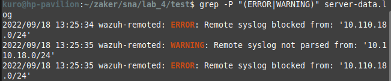

## System and Network Administration - Lab 4 - Text filtering editors
    Jaffar Totanji - j.totanji@innopolis.university

### Questions to answer:
1. We can do this with `grep` by simply matching INFO or WARNING:

        grep -P "(ERROR|WARNING)" server-data.log

    

    We can also use `awk` to match the 4th field to ERROR: or WARNING:, as such:

        awk '{ if($4 == "ERROR:" || $4 == "WARNING:") print }' server-data.log
    
    

2. This can be done with `grep` by matching INFO and then inverting the match using `-v` flag:

        grep -v "INFO" server-data.log
    

3. We can match ERROR with `grep` and then count the number of lines that contain a match using `-c`:

        grep -c "ERROR" server-data.log
    

4. Simply use the `gsub` method of `awk` to replace all occurrences of INFO with NOTHING followed by `print`, then redirect the output to `newlog.log`.

        awk '{gsub(/INFO/, "NOTHING")} {print}' server-data.log > newlog.log
    

5. The regex I created:

        ^[0-9]{4}\/[0-9]{2}\/[0-9]{2} [0-9]{2}:[0-9]{2}:[0-9]{2} wazuh-remoted: [A-Z]{1,}: Remote syslog ([a-z ]){1,}: '([0-9]{1,3}\.){3}[0-9]{1,3}\/[0-9]{2}'$

    and the full command is:

        grep -P "^[0-9]{4}\/[0-9]{2}\/[0-9]{2} [0-9]{2}:[0-9]{2}:[0-9]{2} wazuh-remoted: [A-Z]{1,}: Remote syslog ([a-z ]){1,}: '([0-9]{1,3}\.){3}[0-9]{1,3}\/[0-9]{2}'$" server-data.log 
    
    

## End of Exercises