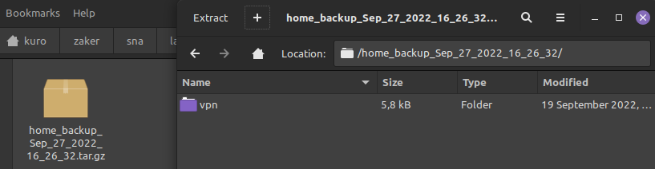

## System and Network Administration - Lab 5 - Bash scripting
    Jaffar Totanji - j.totanji@innopolis.university

### Questions to answer:
1. The environment variables in question are pretty well-known, in case on wanted to view them, this cane be done using `env` or `printenv`. The script itself is quite simple, it prints the a dscriptions along with its corresponding environment variable, with the exception of the IP Address which is extracted from `ip a` using `awk` then saved to `ipaddress` variable and then printed just like the others. Here's the result of running the script:

    

2. The script is pretty straightforward, it first finds the current date in the required form using `date` and saves it to a variable `$cur_date`. Then creates a new directory `backups/home_backup_$cur_date/` under the current directory (not /backups/ in order not to mess with the file system on my main machine) if it doesnt already exist. The script then proceeds to copy the contents of the machine's home directory to the newly created directory using `cp -Rp` to that recursively and maintain all the file ownership/permissions while doing so. Finally, the script compresses to a `.tar.gz` archive with the same name and deletes the temporary folder. Here are screenshots of the script creating a backup of a simpler directory (my home directory is quite large):

    
    

3. This can be achieved in one line using `find` to go through everything in the filesystem along with `-type f` flag to go through files only and the `-executable` flag to filter out files for which the current user has execute permissions. We then pass each result of that output to `grep` using `find`'s `-exec` flag which executes whatever command is given after it on every result of the search. The `grep` command itself uses `-Rl` flags to execute the command recursively and show only the file names which contain the match `/bin/bash` instead of the match itself. Finally, `STDERR` is redirected to `/dev/null` to suppress errors caused by entries for which the current user has no read permission. Part of the output of the command looks like this:

    

## End of Exercises