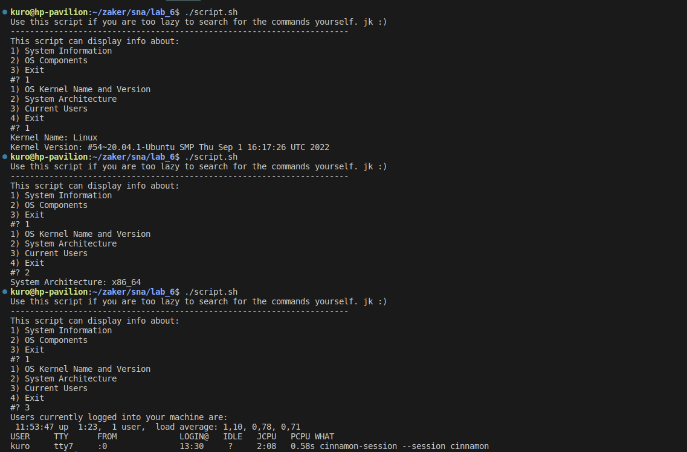
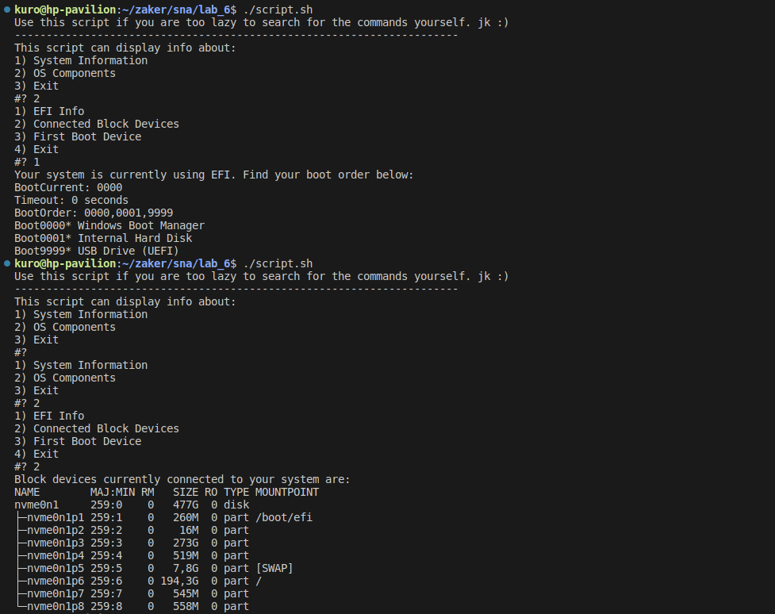
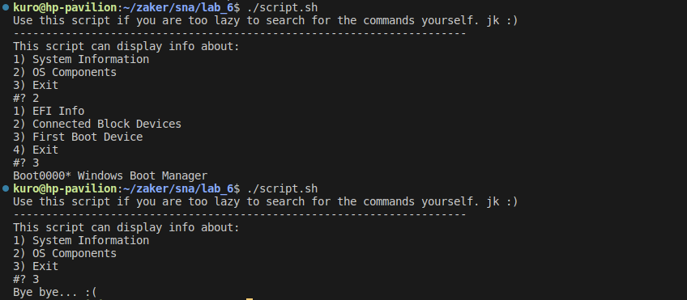

## System and Network Administration - Lab 6 - Bash scripting 2
    Jaffar Totanji - j.totanji@innopolis.university

### Questions to answer:
1. Not a whole lot to explain for this lab. I simply implemented the menu and sub-menu according to the requirements. Here are some screenshots of the features in action:

## End of Exercises