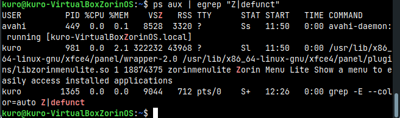
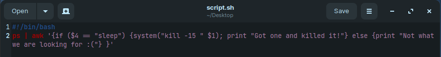
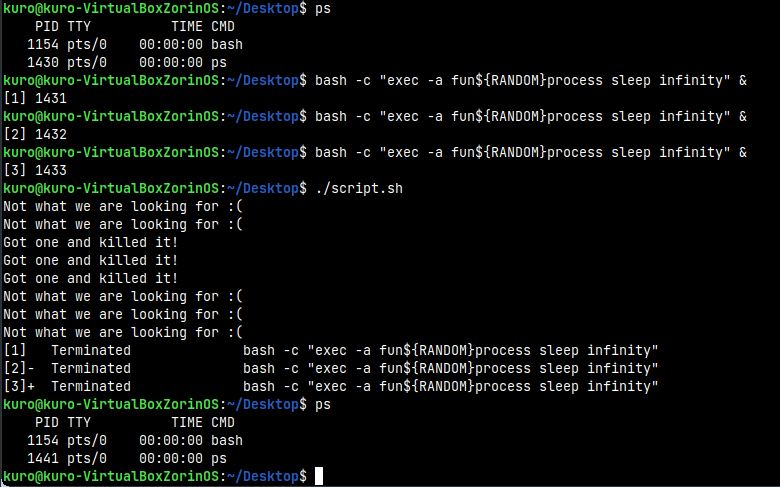
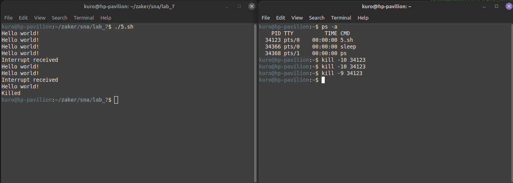

## System and Network Administration - Lab 7 - Processes and signals
    Jaffar Totanji - j.totanji@innopolis.university

### Questions to answer:
1. A zombie process is a process whose execution is completed but still has an entry in the process table. Zombie processes usually occur for child processes, as the parent process still needs to read its child’s exit status. Once this is done using the wait system call, the zombie process is eliminated from the process table. This is known as reaping the zombie process.

    To kill such processes, we first need to find them. We can do that using:
        
        ps aux | egrep "Z|defunct"

    `ps aux` shows all our processes in a human-readable format with useful columns. `egrep` is then used to match an extended regular expression `"Z|defunct"` which matches zombie processes and anything with a `Z` in it. Then, we can select a zombie process that we want to kill and copy its `PID`.

    

    I don't have any zombie processes on my VM nor on my main machine, but let's pretend that I did have one with pid `5555`. I could do the following to kill it:

        pstree -p -s 5555

    That would display a tree-like structure containing the ancestors of the process. From there, we can identify the immediate parent of that process (let's say its 7777), and send it a `SIGCHLD` signal, which tells the parent process to execute the wait() system call and clean up its zombie children.

        kill -s SIGCHLD 7777

    If that doesn't get rid of the process, then we can try killing the parent process:

        kill -9 7777

    If that doesn't kill it, then a system reboot might be the last resort.

2. - `kill` will simply send a signal to a process based on its `PID`.

        

    - `killall` does the same thing, but by specifying the exact name of the process, instead of its PID. If more than one process runs with that name, all of them will be killed.

        
    
    - `pkill` does essentially the same thing with a few differences. One difference is that `killall` takes the exact name of process as the argument whereas `pkill` can take partial or complete name.

        

3. The `Tasks` and `%Cpu(s)` rows contain the following fields:
    

    - `Tasks`: 
        - `total`: Total number of processes.
        - `running`: Processes that are either executing on the CPU or ready and waiting to be executed.
        - `sleeping`: Processes that are waiting for an even or an I/O operation to complete.
        - `stopped`: Processes that have been stopped by a job control signal or because they are being traced.
        - `zombie`: Processes whose execution is completed but still have an entry in the process table.
    
    - `%Cpu(s)`:
        - `us`: The time the CPU spends executing processes in userspace.
        - `sy`: The time the CPU spends executing processes in kernelspace.
        - `ni`:  The time spent on executing processes with a manually set “nice”.
        - `id`: The time the CPU remains idle.
        - `wa`: The time the CPU spends waiting for I/O to complete.
        - `hi`: The time spent on handling hardware interrupts.
        - `si`: The time spent on handling software interrupts.
        - `st`: The amount of time lost due to the processor being busy on some VM.
4. Here's the script and a sample of its work:

    

    

5. Here's the script:

    

    I will demonstrate the usage in 2 terminals for clarity (Alternatively, I could have run the script in the background using `&`):

    

    In the first terminal, we simply run the script, and it will start printing `Hello world!` every 10 seconds. 
    
    In the second terminal, we use `ps -a` to get the `PID` of the script process (or just use the name with `killall`), and then send `10` signal to it (which stands for `SIGUSR1`), we can see the output `Interrupt received` in the second terminal which was caught by `trap`. We then send `9` signal to stop the script.

6. Here's the script and a sample of the produced log:

    

## End of Exercises