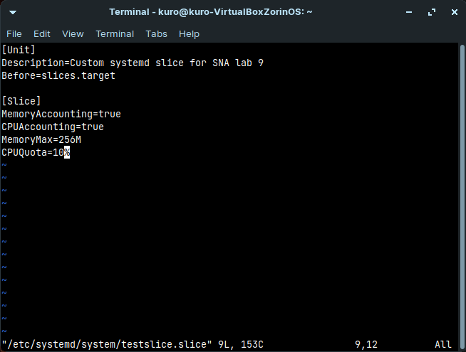

## System and Network Administration - Lab 9 - Systemd
    Jaffar Totanji - j.totanji@innopolis.university

### Questions to answer:
1. For that, we can use:

        systemd-analyze

    

    In order to view the services that have been started and how long it took each of them to initialize, we can use `systemd-analyze` again, but this time with its charting utility `plot`. The resulting chart is huge, so I have only included the top part of it here:

        systemd-analyze plot

    
    

2. We can trace back the `Requires` variable of every service using `systemctl`. Our starting point looking like this:

        systemctl show -p Requires graphical.target

    and our chain of services looks like this:

    

    We can then use 

        systemctl list-units --type target

    to view some info about these services as well as others:

    

    - `graphical.target`: `multi-user.target` with GUI.

    - `multi-user.target`: All services running, but command-line interface (CLI) only.

    - `sysinit.target`: System Initialization.

    Let's first start with the meaning of "Wants" and "Requires" from the `man` page:

    - `Requires`: Configures requirement dependencies on other units. If this unit gets activated, the units listed here will be activated as well. If one of the other units gets deactivated or its activation fails, this unit will be deactivated.

    - `Wants`:A weaker version of `Requires`. Units listed in this option will be started if the configuring unit is. However, if the listed units fail to start or cannot be added to the transaction, this has no impact on the validity of the transaction as a whole. This is the recommended way to hook start-up of one unit to the start-up of another unit.

    Focusing on the last 2 lines of the description of `Wants`, `sysinit.target` basically initializes our system aka starts it up, and in order for it to do that, it needs to start up lots of other services for the system to be considered running, and if one of them fails, the transaction is still valid as a whole.

3. The first step is to create a script that starts web server on a certain port and gives us the required statistical info. I did that in the form of 2 scripts, on that prints out the statistics `script_1.sh` and another than runs the previous script on a web server `script.sh`:

    
    

    Then, we need to create a systemd service to accomodate the script at run it at start up and a slice to control resource usage. That is done exactly as described in the lab:

    
    
    

    Finally, the service in action:

    

4. For that, we first need to create a service that updates the package source list:

    

    `update_list` script simply performs the update:

    

    To then run the service periodically, we need to create a corresponding timer for the service that will trigger after boot up and on a daily thereafter:

    

    Finally, we need to do `systemctl daemon-reload` to make `systemd` aware of our new files, and then we need to enable and start the timer which will trigger our service as scheduled:

    

## End of Exercises